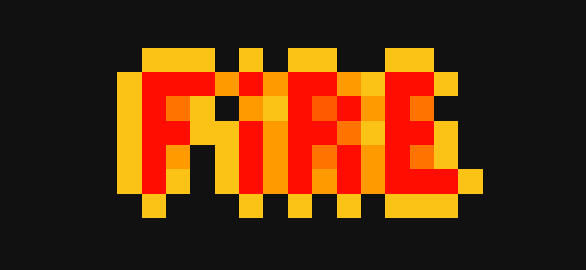

# Game of Fire

You have an infinite plane on which you place square tiles. One at a time, you add new tiles randomly such that each new tile shares at least one edge with a previously placed tile. The probability of a tile being placed in any given location is proportional to the number of edges of previously placed tiles that border that location.



## Live Demo

- You can play with the [live demo](http://logicien.fr/conway/)
- Click cells to toggle their status then press "Play".

## Conway QuantaMagazine tribute

- I wrote this as a tribute to Conway. [QuantaMagazine](https://www.quantamagazine.org/three-math-puzzles-inspired-by-john-horton-conway-20201015/#comments)
- "Inspired" by [ljee](https://github.com/Ijee) game of life implementation.
- Also check [QuantumGame2](https://quantumgame.io/), a quantum optics puzzle game.

## Project setup

```bash
yarn install
```

### Compiles and hot-reloads for development

```bash
yarn serve
```

### Compiles and minifies for production

```bash
yarn build
```

### Run your unit tests

```bash
yarn test:unit
```

### Lints and fixes files

```bash
yarn lint
```

### Customize configuration

See [Configuration Reference](https://cli.vuejs.org/config/).
